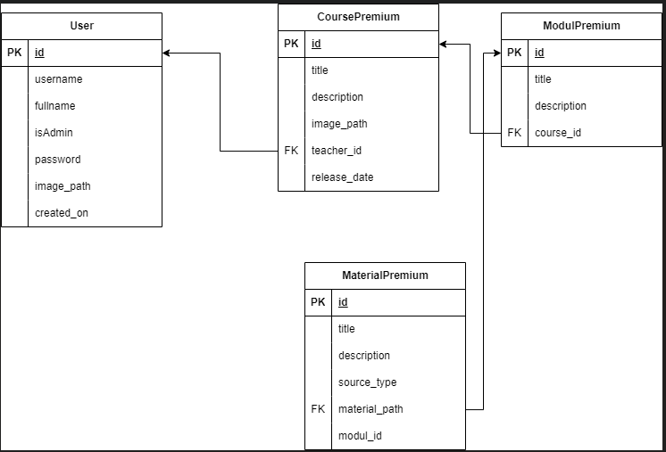

# LeMeS - REST

## Introduction

LeMeS-rest adalah backend dari aplikasi LeMeS yang disediakan untuk admin dan teacher (guru) yang mengelola layanan premium dari aplikasi LeMeS. Aplikasi ini dibuat dengan menggunakan Express, Typescript, dan Postgresql.Aplikasi ini dibuat untuk memenuhi tugas besar mata kuliah Pemrograman Aplikasi Berbasis Web.

## Overview Feature

- Express with Typescript based app
- Auth utilizing JWT
- PostgreSQL as database
- Dockerized
- SOAP calls to binotify-soap
- Static file serving

## Skema basis data

Basis data terdiri atas 4 tabel, yaitu tabel User, CoursePremium, ModulPremium, dan MaterialPremium. Tabel User menyimpan data - data pengguna yang meliputi Teacher dan Admin. Tabel CoursePremium menyimpan data - data terkait CoursePremium yang ada di aplikasi LeMeS. ModulPremium menyimpan data - data terkait ModulPremium yang ada di aplikasi. Sedangkan, MaterialPremium menyimpan data - data terkait seluruh MaterialPremium.

## Daftar endpoint

## Cara menjalankan aplikasi

Alternatif 1:

1. Pastikan sudah terinstall NodeJS dan PostgreSQL
2. clone repositori ini
3. Buat file `.env` pada root folder aplikasi mengikuti contoh .env.example
4. Install dependency dengan menjalankan perintah `yarn install`
5. Jalankan aplikasi dengan perintah `yarn start:prod` jika ingin melakukan seeding terlebih dahulu.
   6.Jalankan perintah `yarn start`

Alternatif 2: Docker

1. Lakukan `docker compose up --build`

### Pembagian Tugas

1. Initial Project Setup: 13521139
2. Migration & Database Schema : 13521139
3. Authentication: 13521139
4. User CRUD: 13521139, 13521164
5. Course CRUD: 13521139, 13521164
6. Modul CRUD: 13521139, 13521164
7. Material CRUD: 13521139, 13521164
8. Middleware: 13520016, 13520073
9. File Serving: 13521139, 13521164
10. SOAP Integration: 13521139
